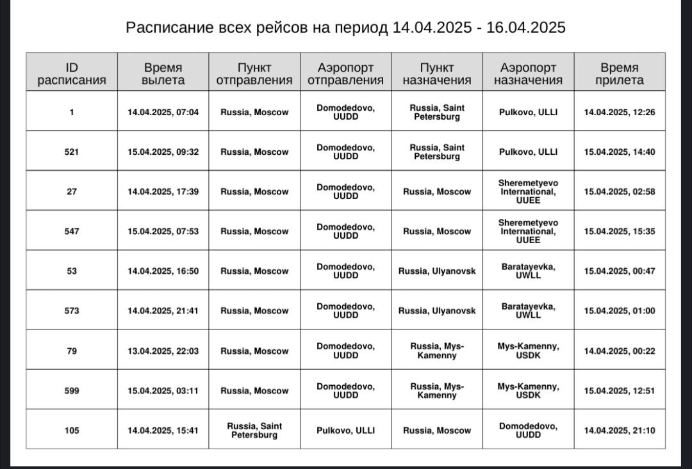
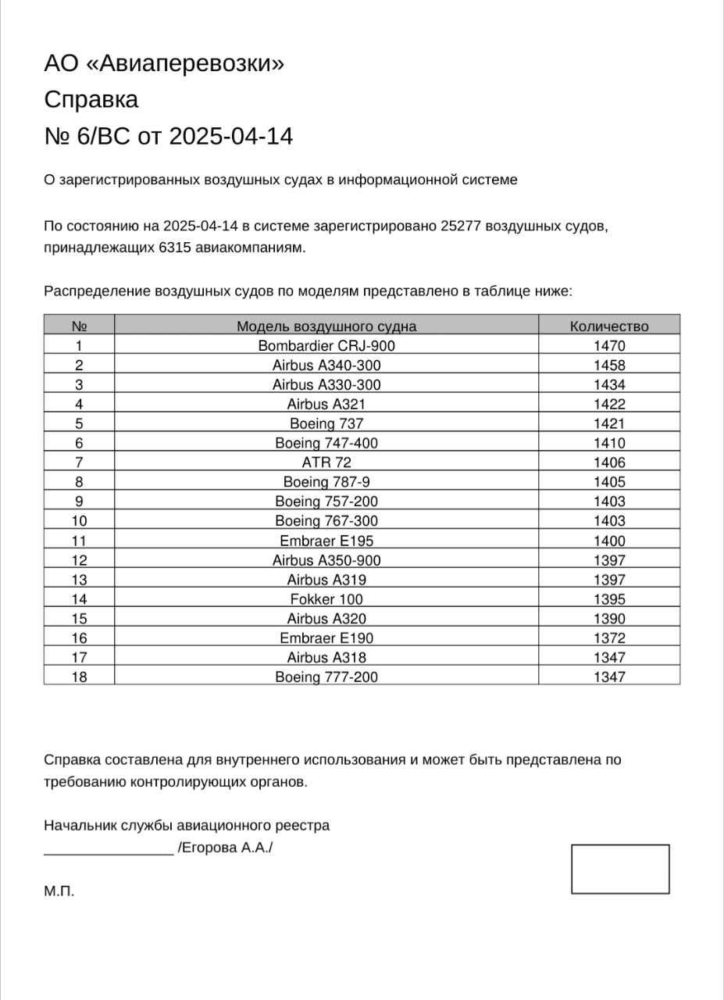

<!-- Table of Contents -->

# :notebook_with_decorative_cover: Содержание 

- [О проекте](#star2-about-the-project)
    * [Скриншоты](#camera-screenshots)
    * [Технологический стек](#space_invader-tech-stack)
    * [Фичи](#dart-features)
- [Лицензия](#warning-license)
- [Значимые ссылки](#gem-acknowledgements)

<!-- About the Project -->

# Aviaroute

## :star2: О Проекте

Aviaroute — Android-приложение разработанное в рамках курсовой работы по предмету Проектирование программного
обеспечения.
Приложение предназначенно для поиска авиабилетов. Это позволяет пользователям просматривать доступные
маршруты полетов, включая такую информация, как аэропорты отправления и назначения, цены на билеты и время полета.

<!-- Screenshots -->

## :camera: Скриншоты

|                                             |                                             |
|---------------------------------------------|---------------------------------------------|
|                      |                      |
| Экран ввода поисковых параметров            | Экран ввода аэропорта                       |
|                      |                      |
| Экран ввода аэропорта                       | Экран выбора даты                           |
|                      |                      |
| Экран выбора даты                           | Заполненные поисковые параметры             |
|                      |                      |
| Заполненные поисковые параметры             | Экран с результатами поиска                 |
|                      |                      |
| Экран с результатами поиска                 | Сортировка списка                           |
|                      |                      |
| Сортировка списка                           | Измененная сортировка списка                |
|                      |                      |
| Измененная сортировка списка                | Экран с результатми поиска после сортировки |
|                      |                     |
| Экран с результатми поиска после сортировки | Полная информация по выбранному билету      |
|                     |                     |
| Полная информация по выбранному билету      | Вы уверены, что хотите купить?              |
|                     |                    |
| Вы уверены, что хотите купить?              | Экран личного кабинета                      |
|                    |                    |
| Экран личного кабинета                      | Сохранённые рейсы                           |

<!-- Features -->

### :dart: Фичи

- **Flight Search:** Ищите доступные маршруты, выбирая между аэропортом отправления, назначения и датой вылета
- **Flight Information:** Смотрите полную информацию о рейсе
- **Route Details:** Ищите рейсы, сортируйте поисковые результаты по цене, дате отправления, а так же кастомизируйте
  поисковую выдачу, двигая слайдеры на цену и время в пути

<!-- TechStack -->

### :space_invader: Технологический стак
**[Room Database](https://developer.android.com/training/data-storage/room)**: Локальная база данных для хранения аэропортов, сегментов, перелётов  
**[Android SDK](https://developer.android.com/tools/releases/platform-tools)**: Предоставляет необходимые инструменты и API для создания Android-приложений  
**[ViewModel](https://developer.android.com/topic/libraries/architecture/viewmodel)**: Компонент архитектуры Jetpack, предназначенный для хранения и управления данными пользовательского интерфейса с учетом жизненного цикла приложения
**[LiveData](https://developer.android.com/topic/libraries/architecture/livedata)**: Компонент Jetpack, обеспечивающий реактивное программирование с учетом жизненного цикла приложения, используемый для работы с данными, которые могут изменяться 
**[Kotlin](https://kotlinlang.org/)**: Основной язык программирования для создания Android-приложений  
**[Flow](https://kotlinlang.org/docs/flow.html)**: Асинхронный поток данных, встроенный в Kotlin, для управления последовательностью событий  

## Installation

1. Clone the repository:
   ```bash
   git clone https://github.com/aDragon1/Aviaroute.git
2. Have fun with it

## :warning: License

Поставляется без лицензии. Смотри LICENSE для дополнительной информации

<!-- Acknowledgments -->

## :gem: Значимые ссылки

- [Readme Template](https://github.com/Louis3797/awesome-readme-template)